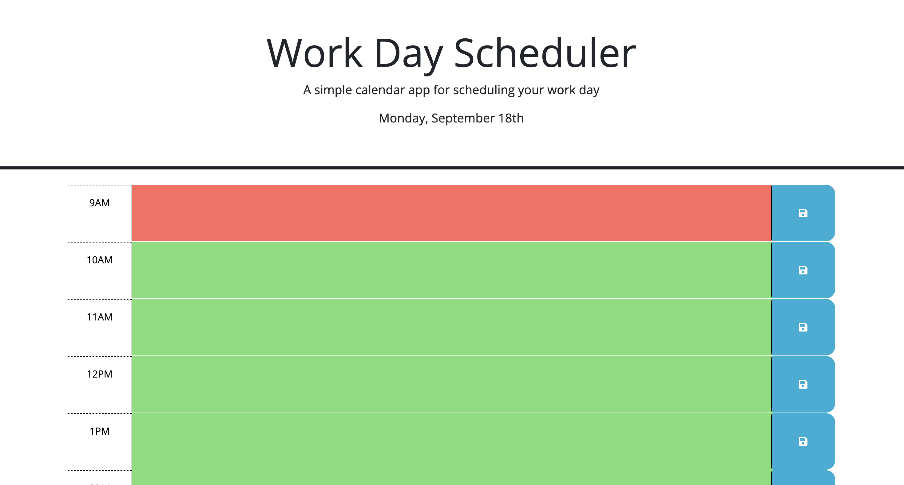

# Work Day Scheduler

## UCLA Bootcamp Module 5 Assignment

## Description

This project is a scheduler for the work day. The following is implemented in the planner:

1. Upon opening the schedule, the user will be able to see the current date.
2. The current hour will be highlighted in red, the past will be grey and the future will be green.
3. The user will be able to add appointments to the calendar on save. They will see a notification that the appointment was saved.
4. Upon saving, the appointements will be saved to localStorage.
5. On refresh, the appointments will be shown on the screen to the time block in which it was entered.
6. The user will be able to change the appointment text and the changes will be shown.

## Installation

This project can be accessed via Github Pages at https://ramitaarora.github.io/work-day-scheduler/.

## Usage

## Credits

This project was created by Ramita Indurkhya.